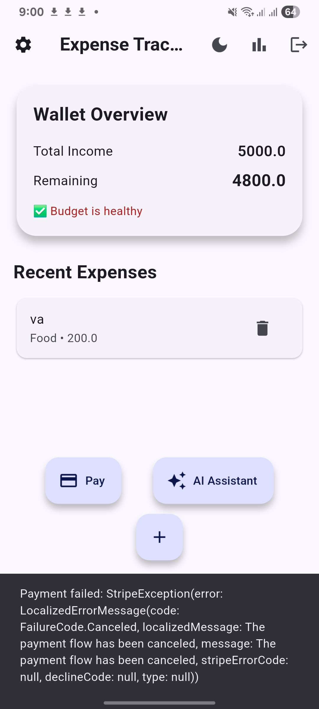
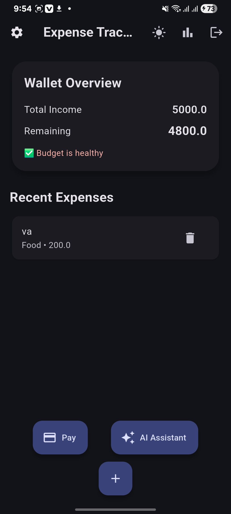

#Expense Tracker

A modern Flutter expense tracking application powered by Firebase, with Stripe payment integration and an AI assistant using Google Gemini.

##Features

User authentication (Register, Login, Email verification)

Firebase-backed real-time expense tracking

Wallet overview (total income & remaining balance)

Stripe payment integration (secure PaymentIntent flow)

AI assistant powered by Google Gemini

Light & Dark mode support

Clean and responsive Material 3 UI

images
<h2 align="center">📱 App Screenshots</h2>

  
  
  

  
  
  

##Quick Start

1. Install Dependencies
flutter pub get

2. Firebase Setup

Create a Firebase project

Enable:

Authentication (Email/Password)

Cloud Firestore

Download Firebase config files:

google-services.json (Android)

GoogleService-Info.plist (iOS)

Run:

flutterfire configure

3. Environment Variables (Flutter)

Create a .env file in the Flutter root directory:

GEMINI_API_KEY=your_gemini_api_key
STRIPE_PUBLISHABLE_KEY=pk_test_your_stripe_publishable_key
STRIPE_PAYMENT_URL=https://your-stripe-backend-url/create-payment-intent

⚠️ Do not commit this file

4. Stripe Payment Backend (Node.js – Payment Only)

Node.js is used only to securely create Stripe PaymentIntents.

on render fill this form
Build Command: npm install
Start Command: npm start

payment run on this url:

https://stripe-backend-lnce.onrender.com

Backend .env
STRIPE_SECRET_KEY=sk_test_your_stripe_secret_key
PORT=3000

All user data and business logic remain in Firebase.

5. Run Flutter App
   flutter run

Technology Stack
Frontend

Framework: Flutter (Dart)

State Management: Provider

Authentication: Firebase Auth

Database: Cloud Firestore

Payments: flutter_stripe

AI: Google Gemini API

UI: Material Design 3

Backend (Payment Only)

Payment requirement
Runtime: Node.js
Framework: Express.js
Purpose: Stripe PaymentIntent creation

Hosting: Render 

###Architecture

#ExpenseTracker
├── Flutter App
│   ├── Firebase Auth (Users)
│   ├── Firestore (Expenses & Wallet)
│   ├── Stripe (Client SDK)
│   └── Gemini AI (Chat Assistant)
│
└── Payment Backend (Node.js)
└── Stripe PaymentIntent API

###Project Structure

lib/
├── screens/
│   ├── auth/
│   ├── home/
│   ├── expense/
│   ├── report/
│   └── ai/
├── providers/
├── services/
├── manager/
├── widgets/
├── routes/
├── theme/
└── main.dart

backend/
└── server.js   # Stripe PaymentIntent only

Security Notes

Stripe secret key never exposed to Flutter

Firebase handles authentication & data security

.env files are excluded from version control

Use Firebase Security Rules before production